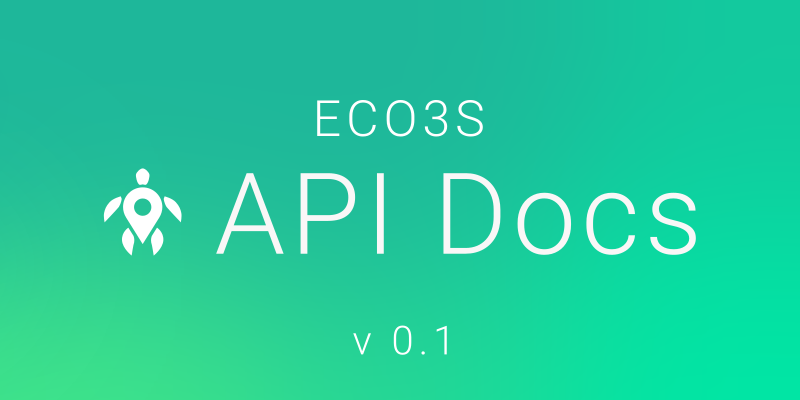

# Banner

[Logo](../logo/README.md)와 동일한 팔레트와 로고를 사용하는 배너입니다.

## Preview

### Docs Banner

[Docs](https://github.com/eco3s/docs)의 `og:image` 프리뷰에 사용되는 배너 이미지입니다.

## Folder Hierarchy

-   [source](source): 원본 파일들을 담은 폴더입니다.
-   [exported](exported): 원본 파일로부터 생성되거나 렌더링된 결과를 담은 폴더입니다.
    -   [png](exported/png): PNG 결과물들을 담은 폴더입니다.

## Pallet

[Logo](../logo/README.md)의 [팔레트 문단](../logo/README.md#Pallet) 문단을 참고하십시오.

## Etc

[source/gradient](source/gradient) 폴더에 있는 SVG파일들은 현재 메쉬 문제로 인해 SVG에서 깨져서 보일 수 있습니다. \
특히나 자주 바뀌는 정보인 version의 경우, 텍스트를 path로 렌더링하지 않았기에 특정 폰트가 없는 기기에선 글자가 보이지 않을 수 있습니다. \
당분간은 [exported/png/gradient](exported/png/gradient) 폴더에 있는 출력 결과물을 사용해 주세요.

현재 `exported` 폴더에 있는 출력물은 `800x400` 비율밖에 없습니다.
