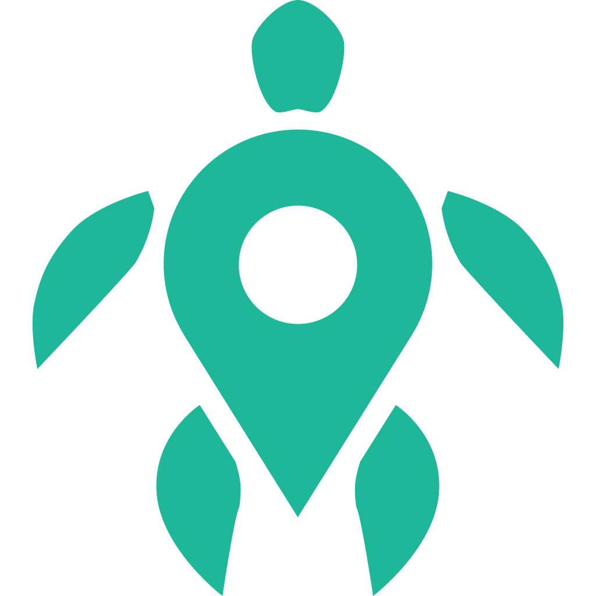
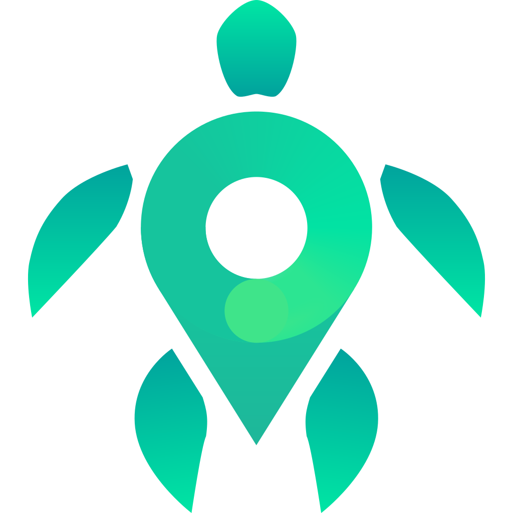
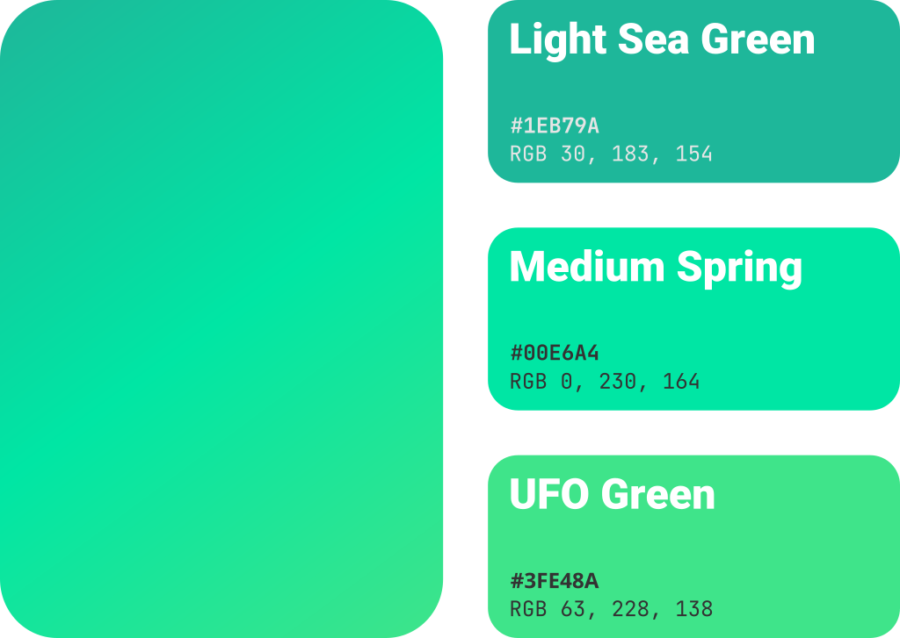

# Logo

Eco3s 프로젝트의 로고입니다.

> **Warning** \
> 현재까지 정식 로고가 정해지지 않았으며, 해당 로고는 임시 로고입니다. \
> 따라서 현재 폴더 내의 모든 파일은 예고 없이 지워지거나, 바뀔 가능성이 있습니다.

## Preview

 

## Naming Conventions

```perl
/(\w+)?\-?(bg-)?(\w+)?\.(png|svg)/
```

한 단어만 써져 있다면 로고의 색상을 의미합니다. \
(예: `black`, `white`, `default`)

`default`인 경우 로고의 기본색을 나타냅니다.
기본색에 대해서는 [Pallet](#Pallet)를 참고하세요.

`bg-(색상명)` 식으로 되어 있다면 배경색을 나타냅니다. \
(예: `bg-black`, `bg-white`, `bg-default`)

## Folder Hierarchy

> **Note** \
> 파일 종류로
> 따라서 현재 폴더 내의 모든 파일은 예고 없이 지워지거나, 바뀔 가능성이 있습니다.

-   [source](source): 원본 파일들을 담은 폴더입니다.
-   [exported](exported): 원본 파일로부터 생성되거나 렌더링된 결과를 담은 폴더입니다.
    -   [png](exported/png): PNG 결과물들을 담은 폴더입니다.
    -   [optimized-svg](exported/optimized-svg): 파일 크기를 줄인 SVG파일들을 담은 폴더입니다.

### Common

-   `monotone`: 단색 로고(+배경색)만을 담은 폴더입니다.
    -   `circle`: 뒷배경으로 배경색의 정원이 들어간 로고입니다.
-   `gradient`: 연속적인 색상 조합이 포함된 로고를 담은 폴더입니다.
    -   `circle`: 뒷배경으로 배경색의 정원이 들어간 로고입니다.

## Pallet



초록색 계열의 고채도 색상 팔레트를 사용합니다.

| Name                | Hex       | RGB                 | Note                                         |
| ------------------- | --------- | ------------------- | -------------------------------------------- |
| Light Sea Green     | `#1EB79A` | `rgb(30, 183, 154)` | 파일명에서 `default`는 이 색상을 의미합니다. |
| Medium Spring Green | `#00E6A4` | `rgb(0, 230, 164)`  |                                              |
| UFO Green           | `#3FE48A` | `rgb(63, 228, 138)` |                                              |

## Etc

[source/gradient](source/gradient) 폴더에 있는 SVG파일들은 현재 메쉬 문제로 인해 SVG에서 깨져서 보일 수 있습니다. \
당분간은 [exported/png/gradient](exported/png/gradient) 폴더에 있는 출력 결과물을 사용해 주세요.

현재 `exported` 폴더에 있는 출력물은 1024x1024` 비율밖에 없습니다.
